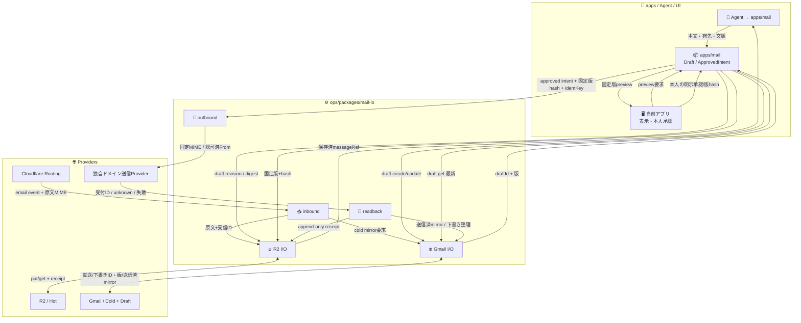

# 📬 Mail Cell — opsの実行基盤（設計案）

Ref: [ADRS #578](https://github.com/roccho-dev/adrs/issues/578) / [apps #4](https://github.com/roccho-dev/apps/issues/4) / [apps PR #80](https://github.com/roccho-dev/apps/pull/80) / [envs PR #58](https://github.com/roccho-org/envs/pull/58) / [mails #1](https://github.com/roccho-dev/mails/issues/1)

**状態: PROPOSAL / docs-only。** 実装・secret・provider設定・deploy・本番送信・merge・accepted meaningを変更・許可しない。

## 結論と責務

- **ops が所有するのは受信/保存/外部下書き同期/送信/receipt のI/Oと実行**。Mailの製品意味、triage、返信案、承認判断は保持しない。
- **apps/coordinate/mail が製品意味**（message/draft/submission/event）、自前アプリは表示・明示承認のUI。旧 [apps#4](https://github.com/roccho-dev/apps/issues/4) のapp-localルールを維持し、独立したmails repoは復活させない。
- **envs は認証と物理target選択**。Google OAuth token、送信Provider秘密鍵はopsのコードやappのbrowser bundleに入れない。
- **R2 Hot** はMIME、凍結revision、idempotency/receiptの証拠。**Gmail Cold + Draft** は受信・送信済み保管、編集可能な下書きのprovider projection。Gmail下書きは送信のauthorityではない。
- 送信は独自ドメイン。Cloudflare Sendingの用途適合は未確認なので**SenderはProvider未固定**。

## 🌳 完成予定dirtree（本PRはファイルを作らない）

```text
roccho-org/ops/
└─ packages/
   └─ mail-io/                  # 必要になってから追加する1つの実行package
      ├─ src/
      │  ├─ inbound.mjs         # Cloudflare Routing event → exact MIME
      │  ├─ r2.mjs              # 原文、immutable revision、receipt
      │  ├─ gmail.mjs           # archive / drafts.create・get・update / readback
      │  ├─ outbound.mjs        # 承認済み固定版 → 交換可能な送信Provider
      │  └─ readback.mjs        # provider受付/不明/送信後の観測
      └─ tests/
         ├─ contract.jsonl     # appsから来るtyped intentと結果の契約
         └─ destructive.jsonl  # 重複・競合・未承認・認証欠損・失敗
```

これは概念的な最小候補。既存packageへ責務を安全に合成できるなら新packageは不要。変更前に現存のCloudflare/Gmail/R2 adapterの実体とimport先を確認し、不要な共通interfaceや第二の台帳を作らない。

対応する他repoの入口（ここでは**変更しない**）:

```text
roccho-dev/apps/packages/coordinate/
└─ mail/ + features/email-triage, email-draft, email-submit + 自前承認UI

roccho-org/envs/
└─ contracts/{bindings,environments,targets,provider-consumer}.jsonl
   + 必要時のみ暗号化正本/target secretへの投影

roccho-dev/adrs/issues/578
└─ 目的・制約・関連Issueの議論
```

## 🏗️ 構成とデータフロー（各edgeにI/O）



## 🔐 操作契約

| 入力・出力 | owner | 拒否/完成条件 |
|---|---|---|
| 受信 `MIME +受信ID` | ops/inbound → R2 | MIME原文の保存成功をreadback |
| `DraftRevision` | apps作成、ops保存/同期 | 下書きprovider IDをアプリ意味の正本にしない |
| `ApprovedIntent(revisionHash)` | apps承認、ops検証 | 元の版・宛先・添付・送信元のdigest不一致なら拒否 |
| `SendEffect(idempotencyKey)` | ops/outbound | 未承認・stale・重複・別actor・rule変更は拒否 |
| `Receipt(status,providerId)` | ops/readback → R2 | 受付≠配送。UNKNOWNは盲再送せず調査 |
| `SentMirror` | ops/Gmail | 送信受付後に観測・整合。mirror失敗はR2原本を壊さない |

実装では受信イベントやProvider responseを**権限のある命令**として扱わない。Gmail APIの`gmail.compose`は送信可能なので、Agent/ブラウザへOAuth tokenを渡さない。送信効果は認証・明示承認のチェックを通る入口だけで実行する。

## 🧪 必須反証・破綻ケース（実装するまで未実証）

1. Agentから直接send → 拒否。
2. 未承認・別本人・期限切れ承認 → 拒否。
3. 承認preview後の宛先・CC・BCC・添付・本文変更 → 新版の再承認要求。
4. Gmail下書き削除・更新競合 → 旧snapshotを勝手に送らない。
5. 同じidempotencyKeyの二重送信/並列競合 → provider effectを二重に起こさない実証。
6. R2の版固定が競合/失敗 → send禁止。
7. 送信Providerのtimeout → UNKNOWNを保存、盲再送禁止。
8. provider受付だけを配送済み扱い → 禁止。
9. Gmail cold mirror失敗 → R2正本を維持、再同期の対象として記録。
10. OAuth失効/権限欠損 → fail closed。
11. Cloudflare/R2 provider secretがbrowser・Agentに漏れる → 検出・停止。
12. 未承認domainの`From`を指定 → 拒否。
13. 添付付きMIMEのbyte不一致 → 拒否。
14. Email Routing転送先未認証 → 本番readyと主張しない。
15. 大容量メール・送信上限違反 → 拒否と証拠保存。
16. 受信本文内のプロンプトで送信許可を偽装 → 拒否。

R2の並行制御、Providerのidempotency保証、Cloudflare一般メール送信用途の可否、Gmail認証フローは**未実証/未決定**。Durable Object、D1、追加queueの採用は必要性と反証結果で決める（先に増やさない）。

## ✅ 完了条件

- opsの実装版に対して正常系・破壊ケースを実行し、保存/送信/失敗/不明のreceiptをreadbackできる。
- Secretは [envs PR #58](https://github.com/roccho-org/envs/pull/58) の責務境界を保つ。Org secretの存在だけでCloudflare runtimeへの配布完了と扱わない。
- apps→opsは`approved intent`、ops→appsは`receipt`の契約で閉じ、provider固有値や認証情報を境界外に出さない。
- 本PRは**設計文書のみ**。これだけではCIの対象パッケージ、live API接続、実装、デプロイ、本番利用、合意採択を証明しない。
