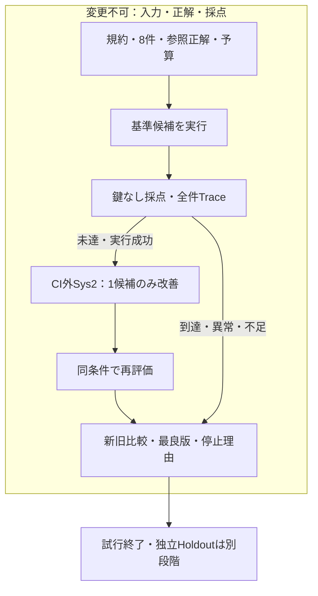

# Sys1 Core品質測定 — Issue記載規約の有限試行

Parent: [ops#523](https://github.com/roccho-org/ops/issues/523).
Meaning: [PR525 fixed design](https://github.com/roccho-org/ops/blob/a27770545ef5fea451f4e67b58ad01d4205d3f0d/docs/proposals/core-issue-state-separation.md).

## 期待

本文の期待宣言と時点付き観測を区別するCoreに対して、同じ固定問題・正解・採点で候補を比較できる。候補はプロンプトだけ、実行・採点は固定する。初回はこのCoreの**本文分類部分**のみ。コメントの事実の真偽、完全な規約適合、必要Core発見、無人運転は対象外。

## 有限契約

8件の合成例。基準1版と、実結果から生成する改善候補最大1版。各版8リクエスト、総上限16。自動retryなし。基準で8/8なら修正を作らない。エラー・欠損・モデル不一致・上限で停止。`contract.json`が問題集と正解のSHA256を固定する。

正解はUser規約から先に導いた**作成者共通の仮参照**。候補実行に渡さないが、独立著者のGoldではない。Holdoutは未用意。8/8は合成例上の目安だけで、製品合格・未知データへの一般化・採用を意味しない。



## 最小構造

```text
experiments/sys1-eval-loop/
├── contract.json       # Eval=(task,labels,caseHash,goldHash,budget,target)
├── cases.jsonl         # model-visible observation only
├── expected.jsonl      # scoring only; not in model input
├── candidates/
│   └── baseline.json   # Candidate=(id,instructions); no executable code
├── run.mjs             # evaluate → predictions; score → metrics; compare → delta
├── test.mjs            # structural tests; never live-quality evidence
└── README.md           # expected contract and closure
```

既存`packages/jev/src/client.mjs`のChoice検証と`core.mjs`の接続を利用する。試行の`ask`境界は注入可能。モデル追加やハーネスの全面構築はしない。モデルID/aliasと応答modelを記録し、異なるモデルの結果は比較拒否する。モデル更新や提供側の非決定性まで固定できるとは主張しない。

## 操作

`node --test experiments/sys1-eval-loop/test.mjs` は鍵・モデルなしの機械検証。
`node experiments/sys1-eval-loop/run.mjs evaluate baseline OUTPUT_DIR` は鍵付きの固定評価工程。
`node experiments/sys1-eval-loop/run.mjs score baseline OUTPUT_DIR` は鍵のない別工程でGoldを読む。
`node experiments/sys1-eval-loop/run.mjs compare BEFORE_SCORED_JSON AFTER_SCORED_JSON` は同契約・同モデルの新旧比較。

CIのsourceはcommit固定、checkout資格情報は残さない。候補・データをコードとして実行しない。鍵は評価工程のみ。既存CI対象リスト・Org Secret設定・他laneの予算を変更しない。結果は小さいjob log/summaryに残し、外部Sys2がexact runから読戻す。自動成果物アップロードを要件にしない。

## 完成条件と停止

全8件（異常後の未実行も含む）が結果に残り、正解照合・誤警報・見逃し・モデル・呼出数・usage・費用不明を区別できる。同じ契約に対する結果だけを比較し、退行があれば旧版を維持する。`EVALUATED`やCI Greenは機能の結果であり、品質合格や採用ではない。

現在の実行状態・試験結果・gapはIssue/PRコメントへ記録する。
