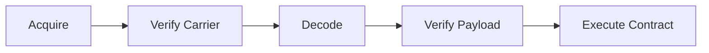
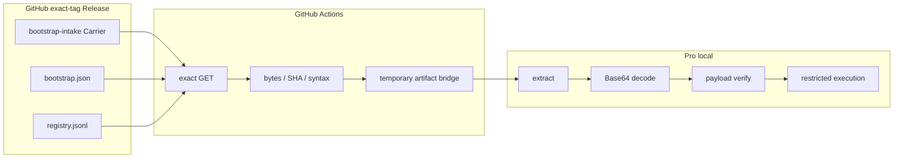
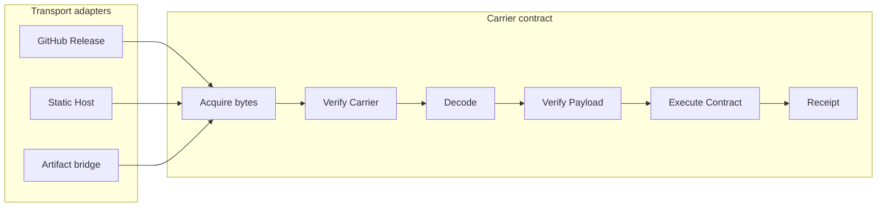

# Carrier

Carrier は、Capability の payload bytes を公開面から取得可能な中立テキストとして搬送するための契約です。

この文書の主題は保存先ではありません。取得経路が変わっても、同じ Carrier bytes を取得し、無補修で decode し、decoded payload を検証して実行契約まで通せることを再利用条件とします。

## 目的

| 世代 | 目的 |
| --- | --- |
| G0 | 公開された Carrier を取得する |
| G1 | 取得経路が変わっても同じ Carrier bytes を local runtime へ渡す |
| G2 | Carrier を無補修で元の payload bytes へ復元する |
| G3 | payload の SHA-256、target、実行形式、identity を検証する |
| G4 | fixture と実処理を実行し、stdout、stderr、exit code を確認する |
| G5 | 取得失敗、不一致、実行失敗を Green にしない |
| G6 | source clone や build を再利用時の必須工程から外す |
| G7 | ChatGPT 固有の取得制約を transport へ閉じ込める |
| G8 | Capability 配布・再利用の限界原価を下げる |
| G9 | 第三者が同じ Carrier を別 transport から再利用できるようにする |
| G10 | 移管可能な能力配布基盤にする |

## 契約

Carrier の最小フローは次の 5 段です。

責務は次の通りです。

| 段階 | 必須条件 |
| --- | --- |
| Acquire | 任意の byte-preserving transport から Carrier bytes を得る |
| Verify Carrier | byte 数、Carrier SHA-256、codec の文字規約を検証する |
| Decode | 指定 codec だけを使い、補修せず payload bytes へ戻す |
| Verify Payload | byte 数、payload SHA-256、target、実行形式、package identity を検証する |
| Execute Contract | timeout と低権限下で fixture を実行し、stdout、stderr、exit code を比較する |

transport は identity ではありません。GitHub Release、Static Host、GitHub Actions artifact などの経路は交換可能です。

正本として比較するのは、少なくとも次です。

- Carrier bytes と Carrier SHA-256
- decoded payload bytes と payload SHA-256
- kind / target
- 実行物の identity
- fixture の stdout / stderr / exit code

一時 ZIP や中継 artifact 自体の digest は Carrier identity とみなしません。

## fail-closed 規則

次のどれか 1 つでも満たさない場合は実行しません。

1. exact release/tag と expected asset が確定している。
2. Carrier byte 数が一致する。
3. Carrier SHA-256 が一致する。
4. Carrier が指定 codec の文字規約に一致する。
5. Carrier に許可されていない空白・改行・文字がない。
6. decode が無補修で完了する。
7. decoded payload byte 数が一致する。
8. decoded payload SHA-256 が一致する。
9. OS / CPU / kind / 実行形式が host と契約に一致する。
10. binary identity が期待 package と一致する。
11. fixture の stdout、stderr、exit code がすべて一致する。
12. timeout や制限実行そのものが失敗していない。

asset の並び順、サイズの近さ、generic filename だけで Capability を選びません。

`latest` は reproducible な取得境界として使いません。exact tag と content identity を使います。

壊れた Base64 の空白除去、padding 補完、文字置換、payload patch などを行って Green にしてはいけません。

## GitHub Release boot blob 再利用の実証

2026-08-17 に `roccho-dev/ops` の public GitHub Release にある `bootstrap-intake` Carrier を、source clone、build、payload 修復なしで再利用しました。

### 実証対象

Release tag:

`cap-proof2-eefa9f3d9c4a-6a819b1d-0d40-83e8-855a-00e20dd48e56`

Carrier asset:

`carrier.native.linux-amd64-static.9c5977657e2e4476938f9ca4656f0fdd80d2f0cf552fdc72998e9162beae95e3.b64.txt`

| 項目 | 実測値 |
| --- | --- |
| Capability ID | `bootstrap-intake` |
| kind | `native` |
| target | `linux-amd64-static` |
| Carrier bytes | `3,047,604` |
| Carrier SHA-256 | `aab48f3417409f6cbed8e4b189b6491e5c2dfdfc3447470dd48ec5a1c7ea0b45` |
| payload bytes | `2,285,703` |
| payload SHA-256 | `9c5977657e2e4476938f9ca4656f0fdd80d2f0cf552fdc72998e9162beae95e3` |

Carrier は空白・改行を含まず、標準 Base64 alphabet に一致しました。復元時に空白除去、padding 操作、文字置換、byte 補完は行っていません。

### 実証した取得経路

今回成立を確認した経路は次です。

`GitHub Release -> GitHub Actions exact GET -> temporary artifact bridge -> Pro local`

ここで重要なのは direct GET ではなく、境界をまたいだ後も Carrier SHA-256 と decoded payload SHA-256 が一致することです。

`Pro local -> GitHub Release URL` の直接 GET は、この再利用契約の必須条件ではなく、この実証でも対象外です。

### Acquire の再現

Carrier 取得 workflow を新しい attempt として再実行しました。

| 項目 | 値 |
| --- | --- |
| GitHub Actions workflow run | `32020669330` |
| attempt | `2` |
| conclusion | `success` |

取得側で次を検証してから一時 artifact へ渡しました。

- exact-tag Release URL から取得できること
- Carrier bytes = `3,047,604`
- Carrier SHA-256 = `aab48f3417409f6cbed8e4b189b6491e5c2dfdfc3447470dd48ec5a1c7ea0b45`
- whitespace がないこと
- 標準 Base64 alphabet だけで構成されること

artifact を local へ搬送して展開後、local 側でも Carrier byte 数と Carrier SHA-256 を再計算し、取得側と一致することを確認しました。

中継 artifact ZIP の digest は再実行ごとに変わり得ます。これは失敗ではありません。展開後の Carrier SHA-256 が同一であることを境界の合格条件にします。

### Decode の再現

Carrier に対して標準 Base64 decode だけを行いました。

復元結果:

| 項目 | 実測値 |
| --- | --- |
| decoded payload bytes | `2,285,703` |
| decoded payload SHA-256 | `9c5977657e2e4476938f9ca4656f0fdd80d2f0cf552fdc72998e9162beae95e3` |
| asset filename の SHA との一致 | PASS |
| Registry の SHA との一致 | PASS |

使用していない処理:

- 空白・改行除去
- padding の追加・削除
- 文字置換
- 不足 byte 補完
- model による修復
- source からの再生成

### Payload 検証の再現

復元した binary の実測値:

| 項目 | 実測値 |
| --- | --- |
| format | ELF64 little endian executable |
| OS / CPU | Linux / x86-64 |
| link | static |
| `ldd` | `not a dynamic executable` |
| Go version | `go1.23.12` |
| package | `capforge.local/platform/capabilities/bootstrap-intake` |
| `CGO_ENABLED` | `0` |
| `GOARCH` | `amd64` |
| `GOOS` | `linux` |
| `GOAMD64` | `v1` |
| build option | `-trimpath=true` |

`PT_INTERP` と dynamic segment がないことも確認しました。

payload SHA が正しいだけでは boot と判定しません。期待する package identity が `bootstrap-intake` と一致してから実行します。

この規則は、別 Capability の valid ELF を boot と誤認して実行することを防ぎます。

### 実 metadata の再取得

bootstrap inspection 用の text metadata も同じ exact-tag Release から再取得しました。

| file | bytes | SHA-256 |
| --- | ---: | --- |
| `bootstrap.json` | `3,657` | `a640442ee123fabfc75c41b2194389ccb7fffb589e8b2a45a25c3e66c794c1b5` |
| `registry.jsonl` | `10,556` | `4658ab175d06b8b52bddc648452fcf3d5606045e011efd29561292fa258a7e2b` |

metadata 取得 workflow:

| 項目 | 値 |
| --- | --- |
| GitHub Actions workflow run | `32020588075` |
| attempt | `2` |
| conclusion | `success` |

Registry の `bootstrap-intake` レコードが、local で実測した kind、target、payload bytes、payload SHA-256、fixture と一致することを確認しました。

## 実行契約の再現

実行 root には次の 3 file だけを置きました。

- `/boot`
- `/bootstrap.json`
- `/registry.jsonl`

実行境界:

| 項目 | 値 |
| --- | --- |
| uid / gid | `65534:65534` |
| root / boot mode | `0555` |
| metadata mode | `0444` |
| wall timeout | `2s` |
| CPU time | `2s` |
| output file size | `1 MiB` |
| open files | `32` |
| process limit | `32` |
| core dump | `0` |
| address space | `1 GiB` |
| environment | cleared except `GOMAXPROCS=2` |

これは低権限・権限上書込不可の chroot による実行境界です。network namespace の分離までは成立していないため、完全な network sandbox とは表現しません。

### selftest

入力:

`/boot selftest`

結果:

| 項目 | 実測値 |
| --- | --- |
| stdout | `bootstrap-intake selftest PASS\n` |
| stderr | empty |
| exit | `0` |
| 判定 | PASS |

### bootstrap inspection

同じ binary に、Release から取得した `bootstrap.json` と `registry.jsonl` を入力しました。

入力条件:

- bootstrap = `/bootstrap.json`
- registry = `/registry.jsonl`
- release tag = `cap-proof2-eefa9f3d9c4a-6a819b1d-0d40-83e8-855a-00e20dd48e56`
- selected id = `bootstrap-intake`

結果:

| 項目 | 実測値 |
| --- | --- |
| stdout bytes | `5,588` |
| stderr | empty |
| exit | `0` |
| schema | `capforge-bootstrap-inspection/1` |
| status | `PASS` |
| `canExtend` | `true` |
| selected.id | `bootstrap-intake` |
| selected.kind | `native` |
| selected.target | `linux-amd64-static` |
| selected.payloadBytes | `2,285,703` |
| selected.payloadSha256 | `9c5977657e2e4476938f9ca4656f0fdd80d2f0cf552fdc72998e9162beae95e3` |

boot は Registry から次の 6 Capability を読み取りました。

- `bootstrap-intake`
- `capforge`
- `contract-schema`
- `go-hello`
- `go-sum`
- `registry-search`

さらに次段の exact request を生成しました。

| 対象 | payload SHA-256 |
| --- | --- |
| capforge | `f906b4b6d6d7b1b1927a7468f3b0d3c8e0a957641e3a3bed3c3ef3873f6eee46` |
| source kit | `04d632d472eac577f83c774761a7335c2bdbfb6d2e01bc1fa7e25c3669382d13` |

この実証では request 生成で停止しています。capforge、source kit、他 Capability の取得・実行を成功済みとは扱いません。

Release 由来で実行した native executable は `bootstrap-intake` 1 本だけです。

### 負例

入力:

`/boot unexpected`

結果:

| 項目 | 実測値 |
| --- | --- |
| stdout | empty |
| stderr | `bootstrap-intake: unexpected arguments\n` |
| exit | `2` |
| 判定 | EXPECTED_FAIL / PASS |

正しい fixture の成功だけでなく、不正入力が Green にならないことも実行契約に含めます。

## 再利用時に不要だったもの

今回の Carrier 復元・実行には次を使っていません。

- `git clone`
- `git checkout`
- `go build`
- `go install`
- compiler / linker
- source archive
- Go module download
- binary patch
- Base64 repair
- payload rewrite
- 別 Capability の実行

CLI 契約の照合目的で source file を後から読むことは、Carrier から payload を作る工程とは分離します。source を復元、build、repair の入力にした場合は「blob reuse only」とは扱いません。

## 実証済み / 未実証

### 実証済み

- exact GitHub Release boot Carrier の取得
- GitHub Actions artifact を byte-preserving bridge として使うこと
- bridge 後の Carrier SHA-256 一致
- 無補修 Base64 decode
- payload SHA-256 と filename / Registry の一致
- Linux amd64 static ELF であること
- package identity が `bootstrap-intake` であること
- source clone / build なしの native 実行
- selftest の stdout / stderr / exit 一致
- 実 metadata を使った bootstrap inspection
- Registry からの Capability 読取と exact request 生成
- 不正引数の exit `2`
- GitHub Release 上の boot blob が再利用可能であること

### この実証では未実証

- Pro local から GitHub Release URL への直接 GET
- network syscall の完全隔離
- publisher の暗号署名・provenance
- source からの reproducible build
- ARM64 / Windows / macOS 実行
- future Release asset の永久不変性
- capforge / source kit の取得・実行
- 任意 native binary の安全性
- すべての transport での取得可能性

現在の対象 Release が immutable でない場合、将来も同じ asset bytes が残ることは SHA 検証とは別問題です。本番配布では immutable Release または同等の変更不能境界を推奨します。

## 判定

この実証の判定は次です。

| 境界 | 判定 |
| --- | --- |
| Release blob reuse | PASS |
| 取得して local 実行 | PASS |
| Carrier integrity | PASS |
| no-repair decode | PASS |
| payload identity | PASS |
| selftest | PASS |
| bootstrap inspection | PASS |
| negative fixture | PASS |
| source clone / build / repair | NOT USED |
| Pro direct GET | OUT OF SCOPE |
| overall | GREEN |

したがって、次の知見を採択します。

> GitHub Release に置かれた `bootstrap-intake` Carrier は、source clone、build、修復なしで取得し、native boot へ復元し、selftest と実際の bootstrap inspection まで再利用できる。

## 本番形

Carrier の取得先を増やす場合も、実行側の意味契約は増やしません。

公開 metadata には、boot の選択を asset 一覧から推測せずに済むよう、少なくとも次を 1 record として持たせるのが望ましいです。

- `boot.id`
- `boot.asset`
- `boot.carrierBytes`
- `boot.carrierSha256`
- `boot.payloadBytes`
- `boot.payloadSha256`
- `boot.kind`
- `boot.target`
- `boot.packagePath`
- `boot.fixture`

これにより、新しい transport を追加しても Carrier core の意味は増えません。取得だけを adapter として差し替え、同じ検証・実行契約を再利用します。
