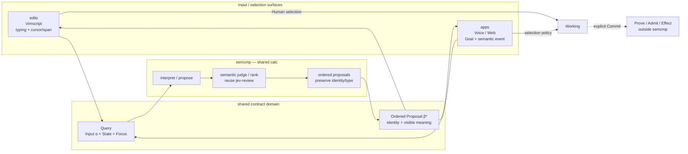

# semcmp contract proposal

Status: **CONTRACT_PROPOSAL / NO IMPLEMENTATION**

Refs: roccho-dev/adrs#526, roccho-dev/adrs#481, roccho-dev/adrs#484, roccho-dev/edits#125, roccho-dev/apps#46, roccho-dev/ops#403.

## Purpose

`semcmp` is the shared calculation boundary that lets a Human give an easy, fuzzy hint and receive a small ordered set of visible meanings that can be selected immediately.

The surface must not require the Human to first write the correct syntax, command, graph operation, or formal type.

Quality means:

- the intended Decision is present;
- it is ranked near the top;
- the Human can recognize it quickly;
- the number of selection/correction steps is small.

## Shared contract domain

The contract must be shared by edits and apps and must not belong to Vimscript, the apps server, or a specific provider.

```text
Q := Input<α> × State<σ> × Focus<φ>

semcmp(Q)
  -> Ordered Proposal<β>*

Surface(Ordered Proposal<β>*)
  -> Selection(proposal_id | cancel)
```

Meanings:

- `Input<α>`: whatever is easiest for the Human to express: typed fragment, voice-derived intent, text Goal, or another meaning-changing input. `α` stays open.
- `State<σ>`: material current + Working + relevant context supplied by the consumer. semcmp owns no accepted state.
- `Focus<φ>`: what is being decided now: cursor/active span, selected object, current decision target, etc.
- `Proposal<β>`: one interpreted meaning. `β` stays open and may represent text, semantic relation, graph edit, function/capability, command, math, or future types.
- `Selection`: the surface points to one proposal identity or cancels. Selection is not Commit/Admit.

A Proposal must preserve enough identity to resolve the selected original meaning after projection. Its Human-facing view may include a short label/type and bounded evidence/why. A proposal may contain a capability/command candidate when that is the inferred intent, but semcmp does not execute it.

## Contract flow



## Responsibility boundary

### edits / Vimscript

Owns only:

- obtain easy fuzzy input;
- provide latest State and Focus;
- call semcmp through the shared contract;
- project returned proposals into native completion/cmp;
- let the Human select/cancel;
- preserve the selected opaque proposal identity.

It does not own interpretation, proposal generation, semantic ranking, command selection logic, effect, Commit, or Accepted state.

### apps

Owns the same consumer boundary with different input/projection/selection policy. Its server/Worker may host or transport calls, including dev-only hosting, but is not semcmp meaning authority.

Existing apps Goal→Choice→Jev flows are consumer evidence, not a second semcmp contract.

### semcmp / ops

Owns calculation only:

```text
fuzzy Input + supplied State + Focus
→ interpret / propose
→ semantic judge / rank
→ ordered heterogeneous Proposal set
```

It owns no surface UI, accepted persistence, Git/State Port, Commit/Admit, or effect.

### jev-review

Reuse the existing JS shared semantic evaluation boundary from ops#403. Jev judges/ranks supplied subjects/questions; it is not required to invent every proposal itself.

Candidate production may later combine deterministic lookup, reuse/search, Sys2, or other proposers. That internal composition is not fixed by this contract.

## Initial implementation choice

Use **JavaScript first** because the existing shared `jev-review` core is JavaScript/Node and this minimizes the first integration cost.

This is an implementation choice, not a semantic contract:

```text
shared contract domain != JavaScript API
semcmp v0 implementation = JavaScript
future implementation language = replaceable
```

Do not add a server, DB, queue, cache, persistence layer, or new provider transport merely to implement semcmp.

## Expected UX behavior

Example:

```text
Input: "api db"
State: API and DB already exist
Focus: current relation unit

semcmp ->
1. API → DB
2. API depends_on DB
3. DB → API
4. keep "api db" as text
```

The important output is not a polished sentence. It is a small visible set of plausible intended Decisions.

A more capable semcmp should allow less precise input while reducing Human steps.

## Quality

Primary measures:

```text
intended@1      ↑
intended@K      ↑
none            ↓
selection steps ↓
large after-edit↓
```

Do not optimize prose quality independently of Decision reachability.

## Non-goals of this PR

This PR does not:

- implement semcmp;
- freeze the exact JSON/JS field schema;
- choose a server or hosting model;
- create an apps- or edits-specific candidate engine;
- make Jev an effect/accept authority;
- require a specific candidate generator;
- define Commit/Admit/State Port persistence;
- claim fuzzy understanding quality is proven.

The next implementation PR should be justified only after this shared contract is accepted and should start with the smallest two-consumer proof that edits and apps can both send the same contract shape and receive selectable ordered proposals.
