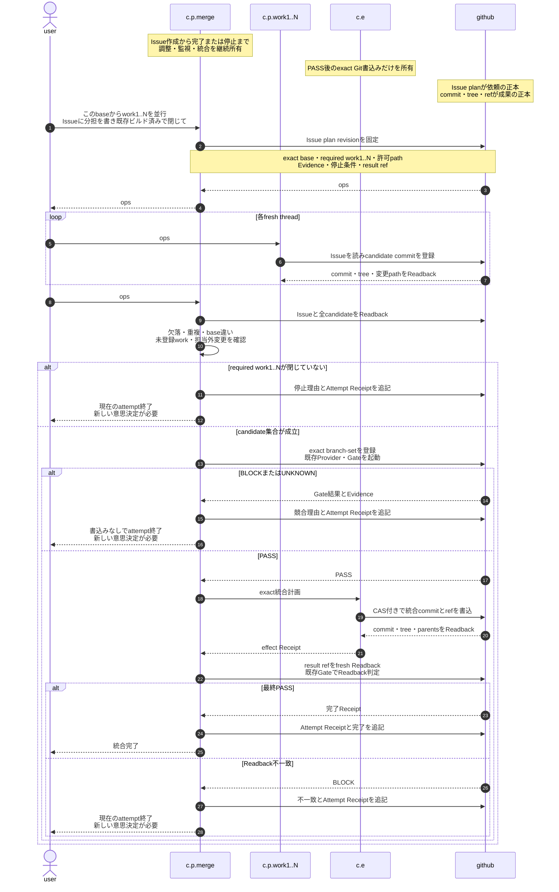

# N-way branch-set runbook

| Field | Value |
|---|---|
| Owner package | `shiftleft-admission` |
| Document ID | `shiftleft-admission/nway` |
| Source | `packages/shiftleft-admission/docs/nway-runbook.md` |
| CLI | `policyctl runbook nway` |
| Nix output | `$out/share/doc/shiftleft-admission/nway-runbook.md` |
| Carry path | `share/doc/shiftleft-admission/nway-runbook.md` |
| Decision authority | existing `shiftleft-admission` Gate |
| Git effect owner | `c.e` through `ops-git-write-closure` |

This document belongs to `shiftleft-admission`. The Markdown file is the source. The Go binary embeds the same bytes, and Nix/carry outputs publish the same bytes at the paths above. Build and artifact replay must reject any mismatch.

## User UX

Start once:

```text
このbaseからwork1..Nを並行して進めて。
Issueに分担とEvidenceを書き、既存ビルド済みとN-wayで閉じて。
```

Each fresh work thread receives only:

```text
ops#XXX / workN
```

A fresh merge thread receives only:

```text
ops#XXX / merge
```

Chat.Pro does not create other Chat.Pro threads. The user opens each fresh thread; the Issue carries all shared context.

## Subjects

| Subject | Owns | Must not own |
|---|---|---|
| `user` | purpose, start, role assignment, new decision after stop | candidate facts or Gate verdict |
| `c.p.work1..N` | one declared candidate, commit, tree, changed paths, Candidate Receipt | another role, branch-set decision, Git effect |
| `c.p.merge` | Issue plan, closed work set, monitoring, branch-set, Gate request, closure | candidate implementation, self-PASS, Git write |
| `c.e` | exact PASS-authorized compare-and-swap Git effect | policy, candidate selection, retry decision |
| `github` | Issue plan, commits, trees, refs, workflow facts, authoritative readback | semantic judgment |

`c.p.merge` is one continuing subject from Issue creation until completion or stop. Coordination, monitoring, and integration are responsibilities of that subject, not extra subjects.

## Closed flow



## Issue plan

One Issue is one parallel-work organization and integration request. One immutable plan revision binds:

```text
repository
exact base commit and tree
required work1..N closed set
role -> branch and allowed paths
required Evidence surfaces
set-wide constraints
Provider identities
PASS / BLOCK / UNKNOWN rules
result ref
no automatic repair or same-attempt restart
```

Changing base, work set, ownership, Evidence, or result target creates a new plan revision. It never silently changes the current attempt.

## Durable records

```text
Issue plan
└─ base, work1..N, ownership, Evidence, stop rules

Candidate Receipt × N
└─ role, branch, commit, tree, changed paths

Attempt Receipt
└─ branch-set revision, Gate, c.e, Readback, terminal result
```

Candidate reports are navigation only. `c.p.merge` must read commit, tree, blobs, paths, refs, and workflow facts again from GitHub.

## Fixed safety rules

1. `work1..N` is a closed required set. Missing, duplicate, or undeclared work never enters integration.
2. Exact commits and trees bind admission; mutable branch names do not.
3. Declared scope is intent. Providers independently observe actual changed paths and governed facts.
4. Providers observe, the existing Gate decides, and only `c.e` writes.
5. Required unobserved Evidence is `UNKNOWN`, never PASS.
6. `BLOCK` or `UNKNOWN` performs no Git effect and appends the reason to the Issue.
7. A failed attempt ends. Repair requires a user decision, new plan revision, new branch-set revision, and new attempt.
8. PASS authorizes only the exact effect plan; compare-and-swap rejects drift.
9. Completion requires authoritative final commit/tree/blob/ref Readback and a final PASS.
10. Monitoring is a `c.p.merge` responsibility invoked by current-state Readback; no separate monitor thread or daemon is required.

## Fresh-thread role prompts

Create or resume the merge subject:

```text
roccho-dev/opsのops#XXXを正本として、あなたはc.p.mergeです。
このrunbookに従い、Issue plan、work1..N、Gate、c.e、Readbackを完了または停止まで所有してください。
過去会話は前提にしないこと。
```

Create a worker:

```text
roccho-dev/opsのops#XXXを正本として、あなたはworkNです。
Issueの担当範囲だけを実行し、commit・tree・変更pathをGitHubからReadbackしてください。
```

## CLI discovery

```text
policyctl --help
policyctl runbook nway
policyctl help nway
```

`--help` shows the Runbook command but does not dump the full Markdown. Both Runbook commands print the exact package-owned Markdown to standard output, so a carried standalone binary remains self-describing.
