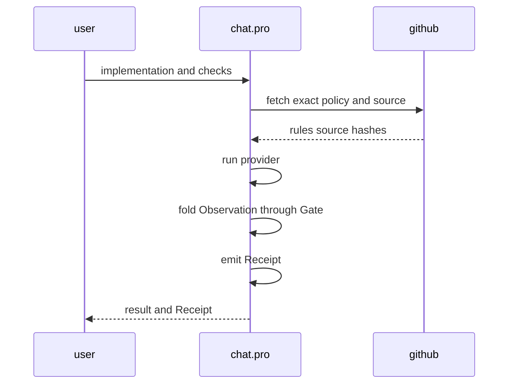
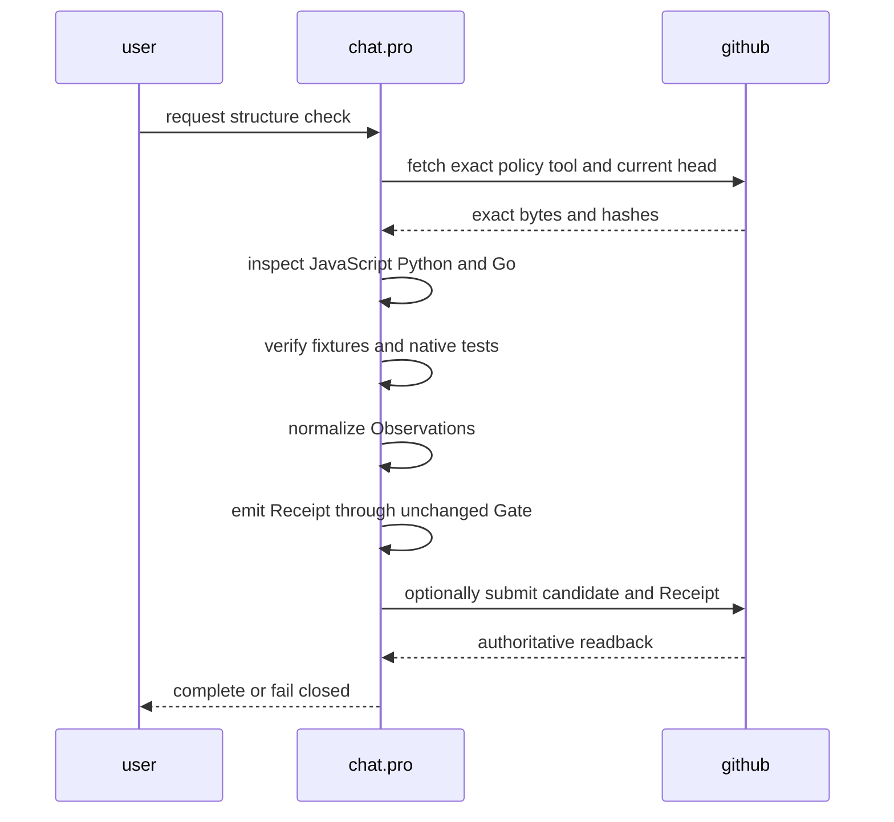

# Structure provider phases

## Fixed boundary

```text
ast-grep observes source structure
policyctl selects and normalizes providers
Gate decides met / unmet / unobserved / not-applicable
Receipt binds policy, tool, rulepack, and candidate identity
```

Pkl or JSONL may author rules, profiles, contracts, and tasks. They do not execute providers, native tests, candidate-drift checks, or Receipt binding.

## Phase 0 — minimum Core



## Phase 1 — shadow parity

The former Go, JavaScript, and Python import parsers and ast-grep ran on identical source bytes. Good, bad, false-positive, false-negative, and syntax-variant cases had the same normalized `shiftleft-import-report/1` meaning. Parity evidence remains in Issue #172 and Git history; it is not shipped as a second active provider.

## Phase 2 — active ast-grep provider



Active assets:

```text
providers/structure/astgrep/normalize.mjs
rulepacks/astgrep/<language>/forbidden-imports.yml
toolchains/astgrep.lock.json
policy/profiles.jsonl
```

The custom per-language import parsers are removed from the active tree. Git history is the retirement store.

## Phase 3 — add only a needed provider

```text
provider addition
= adapter
+ profile
+ pinned tool or config
+ good / bad / false-positive / false-negative fixtures
```

The fixed Core does not grow for a new inspection tool.

## Remains native or custom

- exact tool, adapter, and rulepack identity;
- safe process execution and timeout;
- ast-grep JSON parsing and Observation normalization;
- Package in/out/error/effect and golden/negative route checks;
- native tests and compiler/type/linter evidence;
- runtime stdout/stderr contracts;
- cross-file graph, dataflow, runtime, and semantic checks not proven by an ast-grep rule;
- workspace/candidate binding, drift detection, Gate, Receipt, and #114 admission.

Semgrep is added only when a concrete flow-sensitive rule exists. Pkl is added only when measured configuration duplication justifies it.
