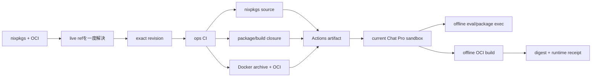

# nixpkgs可用性・OCI build実証

## 判定

`PINNED_NIXPKGS_AND_OCI_CURRENT_SANDBOX_PASS`

| 問い | 判定 | 実測境界 |
|---|---:|---|
| current sandboxからlive nixpkgsへ直接接続 | **BLOCKED** | `channels.nixos.org`をDNS解決不可 |
| pin済みnixpkgs sourceのCarry | **PASS** | `ffb3c9b700e759be2ef13237c9d8f953b32a1e46` |
| nixpkgs package metadataのoffline評価 | **PASS** | BusyBox/JQ/Hello/Skopeo、dockerTools |
| Carry済みpackage closureの実行 | **PASS** | BusyBox 1.37.0、Skopeo 1.24.0 |
| 未Carry packageのoffline materialize | **REJECT** | Hello 2.12.3はsource closure不足 |
| Docker-compatible image build | **PASS** | nixpkgs `dockerTools.buildImage` |
| OCI archive build | **PASS** | pin済みSkopeoでOCI layout 1.0.0へ投影 |
| current sandboxでoffline再build | **PASS** | final outputを事前に除外し、2秒で再生成 |
| current sandboxで新しいOCI imageを作る | **PASS** | `current-sandbox-oci:42` |
| Docker/Podmanなしでimage command確認 | **PASS** | safe rootfs extraction + chroot |

## exact identity

| 項目 | 値 |
|---|---|
| nixpkgs revision | `ffb3c9b700e759be2ef13237c9d8f953b32a1e46` |
| nixpkgs version | `26.11pre-git` |
| CI run | `32342665345` |
| Actions artifact | `9396919502` |
| artifact ZIP | `143,928,856B` / `da45e5ff0ebbc3e13719ea46c84d831671b739e5a891ea14aa262727ffe8bdd9` |
| OCI manifest | `sha256:27ecccbf81400d2b97c9c5aa8208b0206841f0e8d69a927c815981838ab2ebf1` |
| OCI config | `sha256:498c91c23d8eff829dc1dc7a79b1575f57970f1f1bfb5cd752bb75f660e63be2` |
| OCI layer | `sha256:c32cb9310c1e9cd8a1d205dc006cbdd246ad6fe2828b4fa302fc21bd90a46aa8` |
| platform | `linux/amd64` |

## 重要な境界

`nix` runtime、`nixpkgs` source、各packageの実体closureは別物です。今回のartifactはexact nixpkgs sourceと2,078 store pathsを搬入したため、選んだtoolchainとOCI buildをofflineで使えました。一方、未CarryのHelloはversion評価まで可能でも、source取得がDNSで止まりmaterializeできませんでした。

OCIの外側tarはCIとlocalでmtimeが異なりSHAが変わりました。しかし`index.json`、manifest、config、layerは同一digestでした。したがってimage identityはOCIのcontent digestを主とし、tar SHAはtransport receiptとして扱います。

## architecture



## より美しい設計

```text
Capability order
→ exact nixpkgs revision
→ package/build closure selection
→ Nix binary cache projection
→ OCI derivation
→ OCI content digests
→ current-environment receipt
```

通常はnixpkgs全体の全binaryを運びません。注文に必要なpackage closureと共通OCI builder closureだけをmaterializeし、exact revision・derivation・content digestをReceiptへ固定します。
